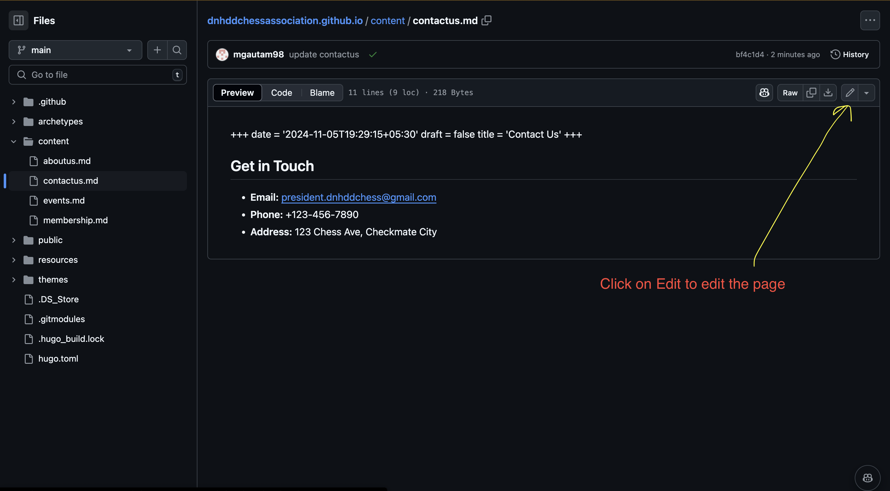

# How to Edit a Page

1. Website pages are inside /content
2. Go to /content
3. Find the page you want to edit, example: aboutus.md
4. Click on the page and open it
5. Click on the pencil icon on the top right corner to edit the page. Image is shown below
   
6. Make the changes you want to make
7. Scroll down and click on the green button "Commit changes"
8. Done! Your changes will be live on the website in a few minutes

# How to Add a New Page

1. Go to /content
2. Click on "Create new file" button
3. Name the file with .md extension, example: newpage.md
4. Add the content to the page
5. Scroll down and click on the green button "Commit changes"
6. Done! Your new page will be live on the website in a few minutes
